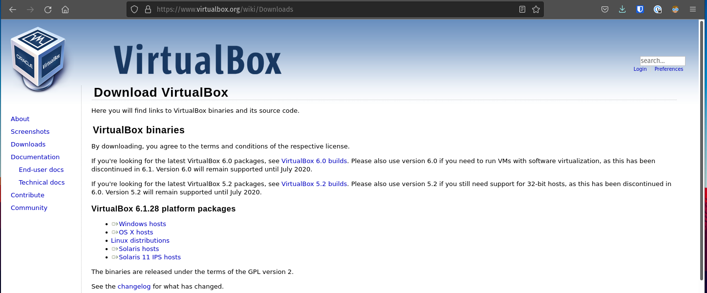
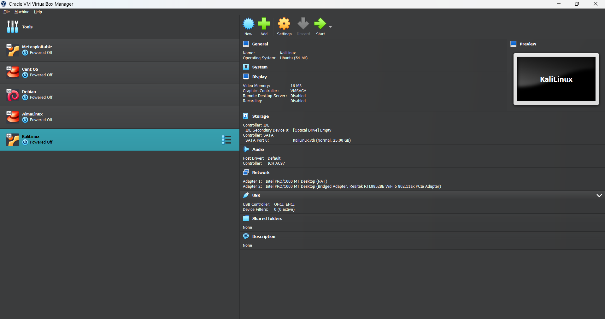
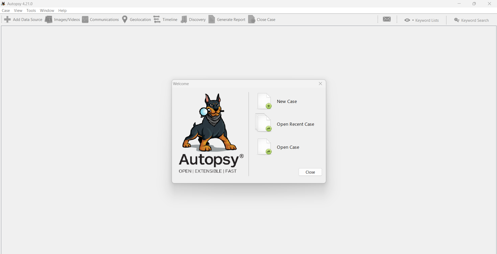
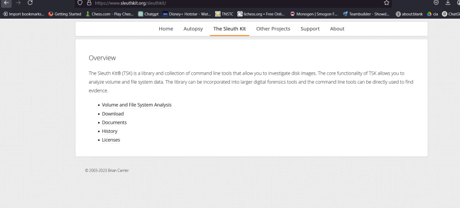
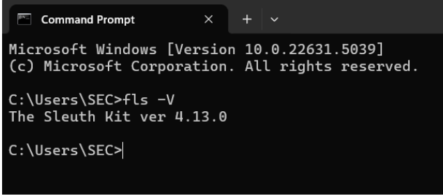
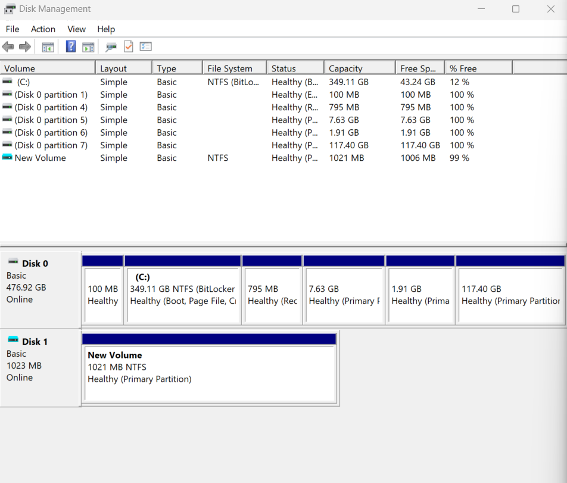

# Simulating-the-Forensics-Lab-Basics
### Name: Samakash R S
### Reg No: 212223230182

## Aim:
<p>To install VirtualBox and set up a virtual machine(Kali Linux), install Autopsy and Sleuth Kit, and use them for forensic investigation by analyzing disk storage and file system.</p>

## Implementation Steps:
## Step 1: Install VirtualBox
<ul> Download VirtualBox: 

[virtualbox](https://virtualbox.en.softonic.com/) 

</ul>

### Installation Steps::
<ol>Download the Windows hosts .exe file from the official VirtualBox website.</ol>
<ol>Run the installer and follow the on-screen instructions.</ol>
<ol>Once installed, launch VirtualBox to verify the installation.</ol>

## Step 2: Install Kali Linux on VirtualBox
<ul>Download Kali Linux VM: 

[kali Linux](https://www.kali.org/get-kali/#kali-virtual-machines)

 </ul>

### Installation Steps:
<ol>Download the Windows ZIP package from the official website.</ol>
<ol>Extract the ZIP folder and move it to a suitable directory (e.g., C:\sleuthkit).</ol>
<ol>Add the bin folder to Windows PATH:</ol>
    <ul>Open Control Panel → System → Advanced System Settings.</ul>
    <ul>Click Environment Variables → Edit Path.</ul>
    <ul>Add the Sleuth Kit bin folder path and save changes.</ul>
<ol>Verify installation by running:</ol>
```
fls -version
```

## Step 5: Create & Configure a Virtual Hard Disk (VHD) in Windows

<ol>Press Win + X, Select Disk Management.</ol>
<ol>Click Action > Create VHD.</ol>
<ol>Choose a location and set a disk size (e.g., 10GB+).</ol>
<ol>Select Fixed Size or Dynamically Expanding and click OK.</ol>
<ol>In Disk Management, find your new disk (marked as "Not Initialized") -> Right-click the new disk → Initialize Disk → Select MBR.
</ol>
<ol>Right-click Unallocated Space → New Simple Volume → Format the disk -> Click next → Finish.</ol>

## Output:
### Virtual Box:


### Virtual Machine (Kali Linux)



<br>

### Autopsy



<br>

### Sleuth Kit




<br>

### Creation of Virtual Hard Disk




## Result:
<p>The installation of VirtualBox, Autopsy, and Sleuth Kit, along with the setup of Kali Linux - Virtual Machine and the creation of a new virtual disk, has been successfully completed.</p>

